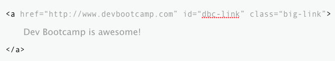
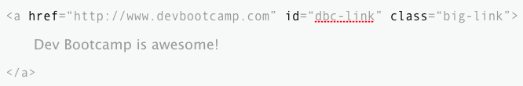
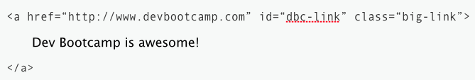
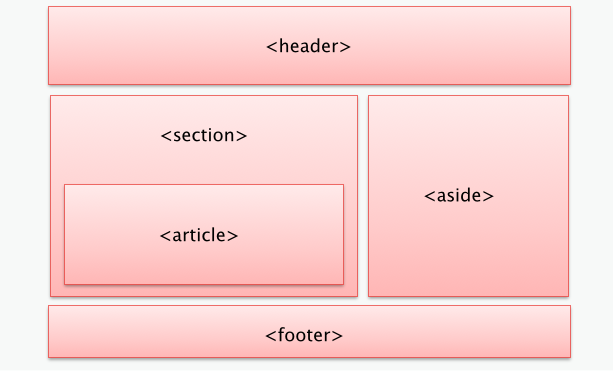
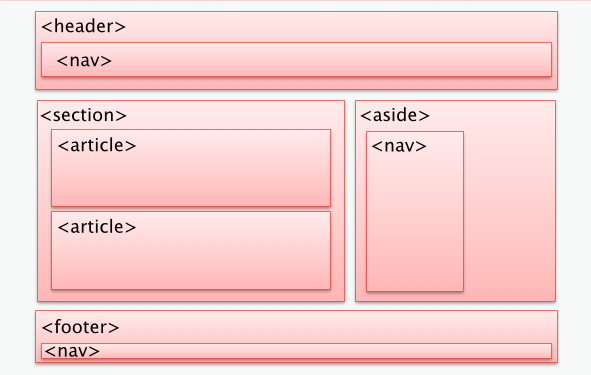
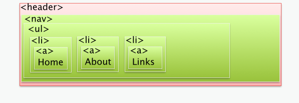

# HTML

Written by [Rebecca Miller-Webster](http://github.com/rmw).

## Introduction

HTML is the language used to create web pages.  CSS is the language used to make the web pages pretty. HTML & CSS are essential tools for web developers.  You cannot develop websites without them.

HTML (<b>H</b>yper <b>T</b>ext <b>M</b>arkup <b>L</b>anguage) describes the content of the page.  You can think of it as basic formatting and outlining of a paper.

HTML consists of *elements* which tell the web browser (e.g. Chrome) organize and describe the content in the document.  The web browser then "renders" (draws) the content on the screen based on default rules defined in the [WC3 specification](http://www.w3.org/community/webed/wiki/HTML/Specifications).

## Document

An HTML page is referred to as a *document*. HTML documents have a required structure that must include the document type declaration, or <code>&lt;!DOCTYPE html&gt;</code>, and the `html`, `head`, and `body` tags.

<code>&lt;html&gt;</code> signals the beginning of the document and <code>&lt;/html&gt;</code> signals the end of the document.

<code>&lt;head&gt;</code> identifies the top of the document and contains *metadata* or accompanying information about the page.  Nothing inside the head is shown on the page.  It includes the document title (text within the `title` tag), which is shown on the title bar in the browser window as well as links to stylesheets (CSS files) and JavaScript files.

<code>&lt;body&gt;</code> contains the content of the page *marked-up* (get it? <small>What does HTML stand for?</small>)  with HTML tags that describe the structure of the content.

## Anatomy of an Element

```html
<a href="http://devbootcamp.com" id="dbc-link">Dev Bootcamp is awesome!</a>
```

### The tag

A *tag* starts with <code>&lt;</code> and ends with <code>&gt;</code>.  An *opening tag* tells us that the element is starting.  The *closing tag*, which starts with <code>&lt;/</code> and the end <code>&gt;</code> tells us the element is done.



Some tags are *self-closing* meaning there is no content and you can end the *opening tag* with /&gt; and omit the *closing tag*.

### Attributes

Attributes are key/value pairs inside the *opening tag*.

The `id` attribute *uniquely* identifies the element on the page.

The `class` attribute is a list of CSS classes separated by spaces.

The `style` attribute allows you to define *inline styles* (CSS within the HTML document) on the element.  *You should NOT do this.*



### Content

Content is between the opening and closing tags.


### Element

All of this together creates an *element*. The letters that follow the &lt; in the *opening tag* (and between the &lt;/ and &gt; in the *closing tag*) tell us what *kind* of element it is.




## Common basic tags

[All HTML tags](http://www.w3schools.com/tags/default.asp)

| Tag | Example | Description | Self-closing |
|-----|---------|-------------| -------------|
| **h1-h6** | <code>&lt;h1&gt;Header 1&lt;/h1&gt;</code> <br />&hellip;<br /> <code>&lt;h6&gt;Smallest header&lt;/&gt;</code> | Header tags. <br/> `h1` is the most prominent header while `h6` is the least prominent header. | No |
| **img** | <code>&lt;img src="my-cupcake.jpg" align=right /&gt;</code> | Image. <br />The `src` attribute contains the path or url to the image. | Yes |
| **div** | <code>&lt;div&gt;</code> <p style="margin: 0 0 0 10px"><code>&lt;img src="my-cupcake.jpg" align=right /&gt; </code></p><p style="margin: 0 0 0 10px"><code>Croissant donut muffin cheesecake. Chupa chups wafer soufflé gummi bears. Tootsie roll pastry cheesecake candy canes cake bear claw croissant.</code></p><code>&lt;/div&gt; </code>| Divison. <br /> Defines a section in the document. | No |
| **p** | <code>&lt;p&gt;Oat cake pie tootsie roll tootsie roll macaroon I love I love. Sweet roll donut jujubes jelly beans cheesecake. Cake I love oat cake jelly tiramisu cake.&lt;/p&gt; | Paragraph. <br />Used for blocks of text. Adds a new line before and after. | No |
| **span** | <code>&lt;span&gt;Liquorice jelly beans&lt;/&gt;</code> | Span. <br /> Usually used to style a bit of text in that's within a paragraph or other container tag. Does not add any new lines. | Yes |
| **br** | <code>&lt;br /&gt;</code> | Line break. | Yes |
| **a** | <code>&lt;a href="http://www.cupcakeipsum.com/"&gt; Cupcake Ipsum &lt;/a&gt;</code> | Link. <br />Create a *hyperlink* to another web page or URL. | No |
| **form** | <code>&lt;form action="cupakes/2/edit" method="post"&gt;</code><p style="margin: 0 0 0 10px;">&hellip;</p><code>&lt;/form&gt;</code> | Form. <br />Creates an HTML form that takes user input and, when *submitted* sends that input to a server. | No |
| **input** | <code>&lt;input type="text" id="cupake_type" value="Pistachio" /&gt;</code> <br /> <input type="text" id="cupcake_type" value="Pistachio Piquant" /> | User input within a `form` tag. <br />There are a number of [*types* of input](http://www.w3schools.com/tags/att_input_type.asp) (defined by the `type` attribute). The most commons types are: <ul style="margin: 0;"><li>*text*: single line text box</li><li>*submit*: submit button<li>*radio*: radio button</li><li>*button*: clickable button (mostly used with JavaScript)</li><li>*checkbox*</li>*hidden*: creates a hidden field (pass data from form to server without showing user)</li><li>*password*: password field, which maskes the typed characters with `*`</li></ul> <br />The *value* attribute is the text shown on the screen. | Yes |
| **label** | <code>&lt;label for="cupake_type"&gt;Flavor&lt;/label&gt;</code> <br /><label for="cupcake_type">Flavor</label><input type="text" id="cupcake_type" value="Pistachio Piquant" />| Label for an `input` element. <br /> The `for` attribute should equal the `id` of the corresponding input. | No |
| **ul**/**ol** <br /> **li** | <code>&lt;ul&gt;</code> <p style="margin: 0 0 0 10px"><code>&lt;li&gt;Pistachio Piquant&lt;/li&gt; </code></p><p style="margin: 0 0 0 10px"><code>&lt;li&gt;Voluptuous Vanilla&lt;/li&gt; </code></p><p style="margin: 0 0 0 10px"><code>&lt;li&gt;Celestial Cherry Vanilla&lt;/li&gt; </code></p><code>&lt;/ul&gt; </code> <ul><li>Pistachio Piquant</li><li>Voluptuous Vanilla</li><li>Celestial Cherry</li></ul><code>&lt;ol&gt;</code> <p style="margin: 0 0 0 10px"><code>&lt;li&gt;Pistachio Piquant&lt;/li&gt; </code></p><p style="margin: 0 0 0 10px"><code>&lt;li&gt;Voluptuous Vanilla&lt;/li&gt; </code></p><p style="margin: 0 0 0 10px"><code>&lt;li&gt;Celestial Cherry Vanilla&lt;/li&gt; </code></p><code>&lt;/ol&gt; </code> <ol><li>Pistachio Piquant</li><li>Voluptuous Vanilla</li><li>Celestial Cherry</li></ol> | Lists and their items. <br />`ul` is an **U**nordered **L**ist (renders with bullets). <br />`ol` is an **O**rdered **L**ist (renders with numbers).  <br />`li` are **L**ist **I**tems. <br />[More about lists](http://www.w3schools.com/html/html_lists.asp).| No |
| **table**<br />**tr**<br />**th**<br />**td** |  <code>&lt;table&gt;</code> <p style="margin: 0 0 0 10px"><code>&lt;tr&gt;</code></p><p style="margin: 0 0 0 20px"><code>&lt;th&gt;Name&lt;/th&gt; </code></p><p style="margin: 0 0 0 20px"><code>&lt;th&gt;Frosting&lt;/th&gt; </code></p><p style="margin: 0 0 0 20px"><code>&lt;th&gt;Cake&lt;/th&gt; </code></p><p style="margin: 0 0 0 20px"><code>&lt;th&gt;Filling&lt;/th&gt; </code></p><p style="margin: 0 0 0 10px"><code>&lt;/tr&gt;</code></p><p style="margin: 0 0 0 10px"><code>&lt;tr&gt;</code></p> <p style="margin: 0 0 0 20px"><code>&lt;td&gt;Pistachio Piquant&lt;/td&gt; </code></p><p style="margin: 0 0 0 20px"><code>&lt;td&gt;Pistachio&lt;/td&gt; </code></p><p style="margin: 0 0 0 20px"><code>&lt;td&gt;Pistachio&lt;/td&gt; </code></p><p style="margin: 0 0 0 20px"><code>&lt;td&gt;None&lt;/td&gt; </code></p><p style="margin: 0 0 0 10px"><code>&lt;/tr&gt;</code></p><p style="margin: 0 0 0 10px"><code>&lt;tr&gt;</code></p><p style="margin: 0 0 0 20px"><code>&lt;td&gt;Celestial Cherry&lt;/th&gt; </code></p><p style="margin: 0 0 0 20px"><code>&lt;td&gt;Cherry Buttercream&lt;/td&gt; </code></p><p style="margin: 0 0 0 20px"><code>&lt;td&gt;Cherry Vanilla&lt;/td&gt; </code></p><p style="margin: 0 0 0 20px"><code>&lt;td&gt;Vanilla Buttercream&lt;/td&gt; </code></p> <p style="margin: 0 0 0 10px"><code>&lt;/tr&gt;</code></p><code>&lt;/table&gt; </code><table><tr><th>Name</th><th>Frosting</th><th>Cake</th><th>Filling</th></tr><tr><td>Pistachio Piquant</td><td>Pistachio</td><td>Pistachio</td><td>Pistachio</td></tr><tr><td>Celestial Cherry</td><td>Cherry Buttercream</td><td>Cherry Vanilla</td><td>Vanilla Buttercream</td></tr></table> | Table, table row, table header, and table data. <br />Tables should only be used for *tabular data* (e.g. stuff you would put in Excel).  For formatting, use `div` with *float* or *inline-block* (see CSS). <br /> [More about tables](http://www.w3schools.com/html/html_tables.asp). | No |
| **strong**/**b** | <code>&lt;strong&gt;Strong&lt;/strong&gt;</code><br /><code>&lt;b&gt;Bold&lt;/b&gt;</code> | Both tags make the text within it **bold**. <br /> `strong` tells the browser that this text is *important*. <br /> `b` just makes the text bold and keeps it unimportant. | No |
| **em**/**i** | <code>&lt;em&gt;Emphasis&lt;/em&gt;</code><br /><code>&lt;i&gt;Italic&lt;/i&gt;</code> | Both tags make the text within it *italic*. <br /> `em` stands for *emphasis* and tells the browser that this text is *important*. <br /> `i` just makes the text italic and keeps it unimportant. | No |

## Semantics

What does it mean to have *semantic* HTML?  Semantics is the practice of giving content on the page meaning and structure by using the appropriately descriptive tag.

Certain types of content lend themselves to certain tags.

| Content | Tag |
|---------|-----|
| Data appropriate for Excel | `table` |
| List of things (images, links, text) | `ul` or `ol` |
| Navigation | `ul` inside `nav` |
| Text | `p` |

### The best cupcake story ever (an example)

Take this html:

```html
<div>A cupcake story.</div>
<div>My favorite cupcakes are from Sugar Sweet Sunshine in New York City.  Their pistachio cupcake is a mint-colored goddess bringing heavenly, dreamy deliciousness to your mouth.</div>
<div>&copy; @rmw</div>
```

We are only using `div` elements for this.  This doesn't tell us the relative importance of the different blocks of text or the structure of this document.  Is this html the whole body? Is it a snippet on the side of the page? We can't tell.

Web browsers and search engines create an *outline* of the HTML document using
the tags.  This HTML is like someone speaking in monotone the whole time.  It's
awkward and annoying.

#### The true best cupcake story evar

Let's refactor that crap HTML into:

```html
<h1>A cupcake story.</h1>
<p>My favorite cupcakes are from Sugar Sweet Sunshine in New York City.  Their pistachio cupcake is a <strong>mint-colored goddess</strong> bringing <em>heavenly, dreamy deliciousness to your mouth</em>.</p>
<small>&copy; @rmw</small>
```

Ahhh. Doesn't it sound so nice now? The excitement of the header! The shout of "mint-colored goddess" and the smooth baratone of "heavenly, dreamy deliciousness."

## HTML5

HTML5 is the most recent version of HTML.  It only became final and complete as of October 2014, but has been in progress since 2004.  The first public working draft was specified in the beginning of 2008.  As of 2011, HTML5 was being used in about a third of websites and by 2013, it was at least partially supported by all major browsers.

HTML5 introduced a number of new tags and apis.

* semantic tags, e.g. `nav`
* metadata tags, e.g. `address` shows address information in search results
* `video` and `audio` tags
* support for SVG (Scalable Vector Graphics)
* `canvas` tag for dynamic content (with JavaScript or CSS3)
* Geolocation
* Storage: session and local storage in the browser

### Semantic tags

The semantic tags of HTML5 are some of the most important developments as they give clearer *structure* to a page.

In fact, browsers consider HTML5 semantic tags before standard tags when creating the HTML document outline.  In other words, the `header` tag is more important than `h1`.

Historically, the best practice (and sometimes browser enforced practice) was to only ever have a single `h1` on a page. With HTML5 semantic tags, each section can have its own `h1`.

Let's take the HTML from [The best cupcake story ever](#the-true-best-cupcake-story-evar) and HTML5-ify it.

```html
<header>
  <h1>A cupcake story.</h1>
</header>
<section>
  <p>
  	My favorite cupcakes are from Sugar Sweet Sunshine in New York City.  Their pistachio cupcake is a <strong>mint-colored goddess</strong> bringing <em>heavenly, dreamy deliciousness to your mouth</em>.
  </p>
</section>
<footer>
	<small>&copy; @rmw</small>
</footer>
```

Now we know this is the full page of this HTML document.  It's a pretty awesome page.

### Creating structure

Using `div` for structure for a web page was a time honored tradition until HTML5 came along and gave us something way better.

The new HTML5 semantic structure tags are here to give meaning to our layout, especially `header`, `nav`, `section`, `article`, `aside`, and `footer`.

#### A basic layout might look like:



#### A layout with navigation in the `header`, `aside`, and `footer`.



#### Header with navigation




## Default Styles

Both the HTML specification and *specific browsers* define the *default* look of a tag.

For example, an `h1` tag will have larger font size and more space around it than a `p` tag.  `ul` will be indented with bullets (filled-in circles) for each `li`.

We can override these styles by using CSS. More on that later.

